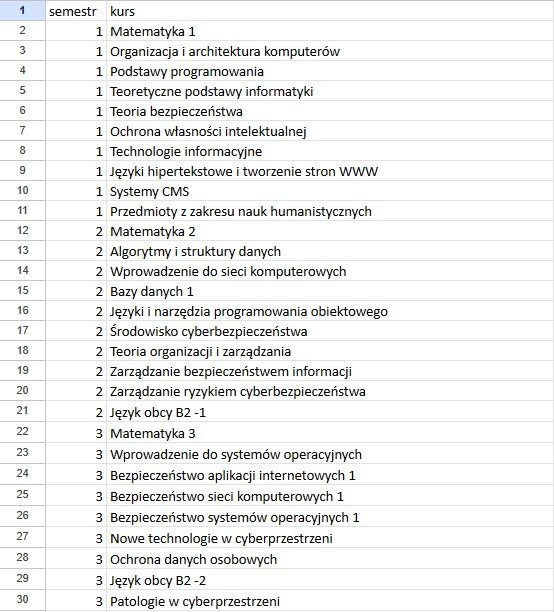

= Zamiana biblioteki PHPExcel na PHPSpreadsheet

== Wprowadzenie
Powodem do zmiany bibliotek był błąd przy zczytywaniu danych z pliku Excel. Wcześniej używaliśmy do tego PHPExcel - biblioteki, która od kilku lat nie jest już aktywnie rozwijana i nie zapewnia wsparcia dla nowszych wersji PHP.

Aby rozwiązać ten problem, zdecydowałem się przejść na PHPSpreadsheet – nową bibliotekę rozwijaną przez ten sam zespół, która jest wydajniejsza i zgodna z najnowszymi standardami PHP. PHPSpreadsheet zapewnia lepszą obsługę formatów Excela oraz jest bardziej elastyczna, co sprawia, że jest preferowaną opcją do pracy z plikami Excel w środowiskach PHP.

W tej dokumentacji opisano kroki wykonane w celu migracji oraz sposób instalacji PHPSpreadsheet za pomocą narzędzia Composer.

== Wymagania
* PHP – Composer wymaga PHP w wersji co najmniej 5.3.2, choć najlepiej używać nowszej wersji PHP (7.4+), aby uniknąć problemów z kompatybilnością.
* Composer - menedżer zależności dla PHP, który automatycznie pobiera i zarządza bibliotekami potrzebnymi w projekcie.

== Proces migracji do PHPSpreadsheet

=== Krok 1: Usunięcie PHPExcel
Usunięcie wszystich plików i folderów związanych z PHPExcel.

=== Krok 2: Instalacja PHPSpreadsheet
PHPSpreadsheet jest oficjalnie rozwijana przez zespół PHPOffice, dzięki czemu można ją łatwo zainstalować przez Composer. W wyniku tej instalacji w folderze projektu pojawił się composer.json - plik zawierający informacje o wymaganych bibliotekach dla projektu. Pojawił się również nowy katalog vendor, zawierający wszystkie zależności zarządzane przez Composer, w tym PHPSpreadsheet.

=== Krok 3: Aktualizacja kodu
Po zainstalowaniu PHPSpreadsheet konieczne było zaktualizowanie istniejącego kodu. Wszystkie wywołania i klasy pochodzące z PHPExcel zostały zastąpione odpowiednikami PHPSpreadsheet.

=== Krok 4: Testowanie
Po zamianie biblioteki przeprowadzone zostały testy, aby upewnić się, że nowe funkcje działają poprawnie i że wszystkie dane z pliku Excel są prawidłowo odczytywane oraz przypisywane do odpowiednich semestrów i przedmiotów.

=== Krok 5: Dodatkowo
Po wszystkich tych krokach, a szczególnie po testowaniu, ujawniono, że przedmioty nie zawsze były poprawnie dodawane. Nie mogą się duplikować - powinny być 63 przedmioty, a było 65, ponieważ dwa się zduplikowały. Ponadto semestry tworzyły się bez shortcode'a, a ich nazwa nie była poprawna – działała na danych ustawionych ręcznie na rok początkowy 2024, co skutkowało tym, że semestry zaczynały się od tego roku, a nie od roku pobieranego z metadanych odpowiedniego rocznika. Podobnie było z sezonem.

== Podsumowanie
Migracja z PHPExcel do PHPSpreadsheet pozwoliła na rozwiązanie problemów kompatybilności i zapewniła większą stabilność oraz lepsze wsparcie dla nowych wersji PHP. Dzięki Composerowi instalacja była szybka i bezproblemowa. PHPSpreadsheet dostarcza bardziej zaawansowanych opcji manipulacji arkuszami kalkulacyjnymi, co w przyszłości może umożliwić dalszy rozwój funkcjonalności aplikacji.

=== Linki
* https://getcomposer.org/download/
* https://github.com/PHPOffice/PhpSpreadsheet
* https://phpspreadsheet.readthedocs.io/en/latest/

=== Excel

== Co dalej?
Przy wykonywaniu tego zadania zauważono niedoskonałości i drobne błedy wymagające poprawy w przyszłości:

* Brak pracowników - może zostali usunięci automatycznie po usunięciu semestrów lub przedmiotów? Możliwe że sam ich usunąłem? - do sprawdzenia.

* Po dodaniu sylabusu do przedmiotu, ten znika z danego semestru.